<p align="center"></p>

# FOCUS

Are you Doom Scroling ? Are you getting traped in shorts & youtube feed? fear not! you can Focous now! just start Focus!


## Features

- Automatically redirects from distracting websites (e.g. TikTok, Instagram, Shorts)
- Hides YouTube Shorts and other addictive sections
- Redirects you to a random productive website instead
- **No AI mode** — also blocks AI chatbots (ChatGPT, Claude, Gemini, Copilot…) so you think for yourself
- **Timed sessions** (optional) — name a session, set its length, and Focus stays locked until the timer runs out
- **Settings page** — toggle modes and manage your own blocked sites / good sources
- Lets you customize which sites to block or promote via **bookmarks**
- Toggle On/Off from popup
- Respects your flow — minimal and framework-free


## 🎨 Design Note
The popup is just one dot, and its background tells you which state you're in:

- **Distracted (off)** — restless navy with a red tint, drifting scribbles, crawling dashed lines and film grain. Busy on purpose: it looks the way a feed feels.
- **Focused (on)** — the clutter collapses into the dot and a still, calm gradient takes over. The dot shrinks a little and breathes slowly.
- **Timed session** — a ring around the dot fills as time passes. Ending early means holding the dot for 5 seconds while a red ring fills, slow enough that you have to mean it.
- **Palette & type** — Tokyo Night colors (`#1a1b26`, `#7aa2f7`, `#f7768e`) and the Nova Square font. The settings page uses the same calm palette as focused mode.
- **No frameworks** — plain HTML/CSS/JS. Animations are CSS, the scribbles are random SVG drawn each time the popup opens, and everything stops if your system asks for reduced motion.


## 🔧 Installation

1. Clone or download this repository:

```bash
git clone https://github.com/ParsaBordbar/focus.git
```

Open Chrome and go to:
chrome://extensions/

Enable Developer mode (top right)

Click “Load unpacked” and select the folder where you cloned the repo

You’re done! You should see the Focus icon in your extensions bar.

### Toggle On/Off
Click on the Focus icon in your extensions bar and use the switch to toggle protection on or off.

### ⚙️ Settings
Click the gear icon in the popup (or right-click the Focus icon → **Options**) to open the settings page. There you can:

- Turn **Focus**, **No AI mode** and **Clean YouTube** on or off
- Add your own blocked sites, one per line: a domain (`reddit.com`), a domain + path (`discord.com/channels`), or a single word to block any domain containing it
- Add your own good sources (these replace the built-in list)

### ⏱️ Timed Sessions
Off by default. Turn on **Timed sessions** in settings and set the length in minutes (1–240). Then:

- Type a name for the session under the dot in the popup (optional; your last name is remembered)
- Press the dot: Focus turns on and the timer starts. A ring around the dot fills up and the toolbar icon shows minutes left
- While the session runs, Focus is locked. To end early, **hold the dot for 5 seconds**
- When time is up, Focus turns off and you get a notification. Completed sessions are listed by name in settings

### 🤖 No AI Mode
Turn it on from the settings page. While Focus is on, AI chatbots are blocked too:
ChatGPT, Claude, Gemini, AI Studio, NotebookLM, Copilot, Perplexity, DeepSeek, Grok, Meta AI, Mistral Le Chat, Poe, Character.AI, HuggingChat, Phind, You.com, Pi, Kimi and Qwen.

### 🔄 Customize Sites
You can also add your own distracting websites and good redirection destinations using Chrome Bookmarks:

1- Open chrome://bookmarks/

2- Create a new folder called:
- Dopamine Sites → for websites you want to avoid
- Good Sources → for websites you want to be redirected to

3- Add any URLs into these folders. Examples:

- Dopamine Sites: https://www.reddit.com, https://twitter.com
- Good Sources: https://wikipedia.org, https://github.com
The extension will automatically read these folders and update the blocking/redirect logic.

### Dopamine Sites (blocked by default)
Content Consumasion Websites & adult content.

- YouTube Shorts (/shorts)
- TikTok
- Instagram
- Twitter (X)
- Reddit
- Facebook
- Snapchat
- Tumblr
- Discord (web)
- Netflix
- Twitch
- Bale (web)
- OnlyFans
- Pornhub
- Xvideos
- XNXX
- 9gag

### Good Sources (redirected to)
- GitHub
- Wikipedia
- Go Docs
- Rust Docs
- FreeCodeCamp
- W3Schools
- Notion
- Lofi YouTube channels
- Medium articles
- Linux learning resources -> lpic1 Book
You can extend this via bookmarks or the settings page!
